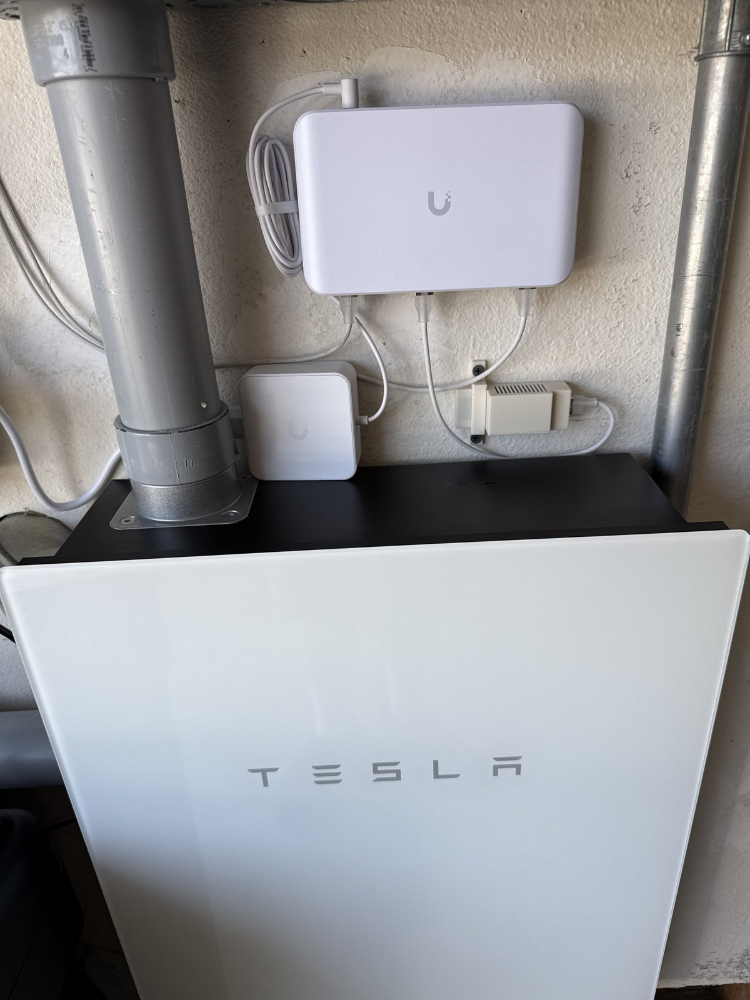
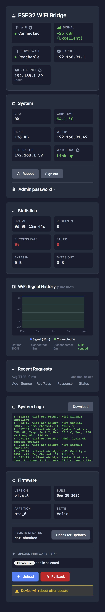
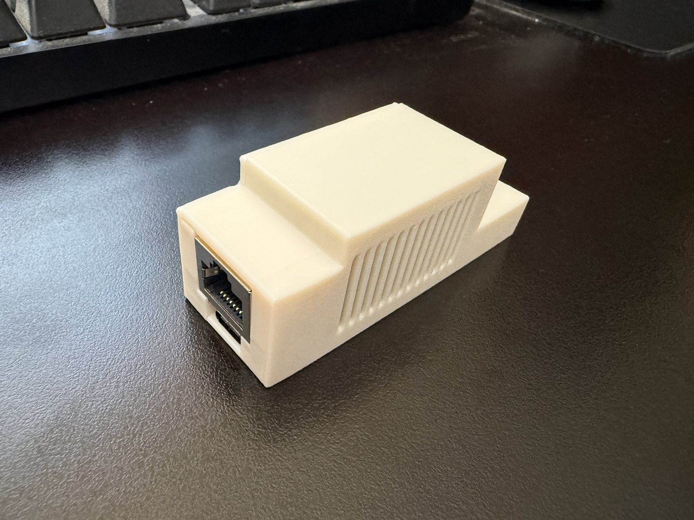

# ESP32-S3-POE-ETH WiFi–Ethernet SSL Bridge

Bridges your LAN to a Tesla Powerwall’s isolated Wi-Fi AP. Encrypted TLS is forwarded as-is (no decryption). TTL is set to 64 so the Powerwall sees local traffic.


**Ethernet `:443`** — Powerwall passthrough (no login).  
**Ethernet `:80`** — dashboard (HTML login, username `admin`).  
Neither port is bound on the Tesla Wi-Fi address.



## Install

Browser flash (Chrome, Edge, or Opera) from GitHub Pages:

**https://erikgieseler.github.io/esp32-wifi-bridge/**

USB to the board, click **Install**. Tagged CI publishes `firmware.bin` and `version.json` there. Remote OTA uses the same URL. Enable **Settings → Pages → Deploy from a branch → `gh-pages`**. Forks do not need `config.local.h`.

After flash:

1. Plug Ethernet (PoE or USB power).
2. Open `http://powerwall.local/` or `http://<ethernet-ip>/`.
3. Set the admin password (first boot).
4. Save the Powerwall Wi-Fi SSID/password.
5. Optional: Ethernet tile → static IP.

Locked out: hold **BOOT 15 seconds** — forces DHCP and clears the admin password.

## Dashboard



- Wi-Fi RSSI and 24 h chart, Powerwall reachability
- Ethernet DHCP or static (click the Ethernet tile)
- CPU, chip temp, heap, uptime, proxy stats
- HTML login + 7-day session cookie (re-login after reboot/OTA)
- Download logs (last 200 lines, HAProxy `httpd*` noise omitted)
- Local upload or GitHub remote OTA

Put the dashboard behind TLS if you want HTTPS: HAProxy (or similar) to `:80`. Health checks should `GET /health` and expect **200**. Do not send a password; `/health` is unauthenticated on purpose.

## Hardware

| | |
|---|---|
| Board | Waveshare ESP32-S3-POE-ETH |
| PHY | W5500 over SPI |
| Framework | ESP-IDF (PlatformIO `espressif32@6.9.0`) |

| SPI | GPIO |
|---|---|
| MISO | 12 |
| MOSI | 11 |
| SCLK | 13 |
| CS | 14 |
| INT | 10 |
| BOOT (hold 15 s) | 0 |

### Printed case

A snap-fit ASA enclosure (no supports) with a wall mount is in [`case/`](case/). Vents are meant for **horizontal** wall install so heat rises through the grille.



## Features

- SSL/TLS **passthrough** to `192.168.91.1:443` with **TTL 64**
- Ethernet **DHCP** or **static IP** (NVS); 45 s gateway-unreachable fallback to DHCP (saved static kept)
- HTTP and proxy **bound to the Ethernet IP only**
- mDNS `powerwall.local` (`_powerwall._tcp` :443, `_http._tcp` :80)
- Admin password: salted SHA-256 in NVS, HTML form, session cookie (`HttpOnly; SameSite=Lax`; `Secure` when `X-Forwarded-Proto: https`)
- Watchdog with two triggers (see below). Default is unchanged.
- NTP over Ethernet, OTA from GitHub Pages, Ethernet DNS snapshot so Wi-Fi cannot steal OTA DNS

## Reverse proxy (HAProxy)

```
backend esp32
    server esp32 192.168.1.39:80
    option httpchk
    http-check send meth GET uri /health
    http-check expect status 200
```

Send `X-Forwarded-Proto: https` on the TLS frontend so the session cookie is marked `Secure` (Safari will persist it). Check interval around 15–30 s is plenty.

## HTTP

Dashboard: `http://powerwall.local/` or `http://<eth-ip>/`  
First boot: set password. Later: **Username — admin**. Port 443 is not this login.

| Path | Auth | Notes |
|------|------|--------|
| `GET /` | session | Dashboard |
| `GET/POST /login` | no | HTML login |
| `GET /logout` | no | Clears cookie |
| `GET /health` | no | `200 ok` for load balancers |
| `GET /logs.txt` | session | Downloadable log dump |
| `GET /api/status` | session | JSON (wifi, eth, temp, heap, watchdog) |
| `GET /api/requests` | session | Recent proxy requests |
| `GET /api/logs` | session | JSON log ring |
| `GET /api/wifi-history` | session | 24 h RSSI buckets |
| `GET /api/update` | session | Remote OTA status |
| `POST /api/check-update` | session | Check GitHub |
| `POST /api/install-update` | session | Install from GitHub |
| `GET /wifi/scan` | session | Scan SSIDs |
| `POST /wifi/save` | session | Save Wi-Fi |
| `POST /eth/save` | session | Save Ethernet (reboots) |
| `POST /watchdog/save` | session | `mode=proxy` or `mode=link` (no reboot) |
| `POST /admin/setup` | first boot | Set password |
| `POST /admin/password` | session | Change password |
| `POST /ota/upload` | session | Upload `.bin` |
| `POST /reboot` | session | Reboot |

Unauthenticated page requests redirect to `/login`. APIs return JSON `401`.

### Ethernet static IP

1. Dashboard → Ethernet tile → Static IP (address, mask, gateway, DNS).
2. Save (reboots).
3. If you lose it: wait ~45 s for DHCP fallback, or hold BOOT 15 s (also clears the admin password).

### Admin password

Stored as salt + SHA-256 in NVS, not in the firmware image. Change it from the System card (collapsed). Reboot/OTA drops RAM sessions; the cookie may still be in the browser until you sign in again.

### Watchdog

Click the **Watchdog** tile on the System card. Pick a trigger and **Save**. The device does not reboot. The choice is stored in NVS, survives OTA, and is not cleared by the 15-second BOOT hold.

| Trigger | When to use it | What it does |
|---|---|---|
| **Proxy clients** (default) | This bridge is the path clients use to reach the Powerwall | Stays **Idle** until the first successful proxy. Then reboots if no client completes a proxy for 10 minutes. |
| **Powerwall link** | Another path on the LAN reaches the gateway and this bridge is only a fallback | Ignores whether anyone is using the proxy. Reboots only if `192.168.91.1:443` stays unreachable for 10 minutes. |

The 10-minute clock in Powerwall link mode does not start until Wi-Fi has associated at least once, so boot is not treated as a failure. Reachability is a short TCP connect to `192.168.91.1:443` every **5 minutes** (not while the dashboard is merely refreshing). The tile keeps the last result. One extra check runs before a reboot, so a link that recovered is not reset by a stale failure. The tile shows **Link up**, or **Link down** with how long it has been down (yellow, then red, as it nears 10 minutes). If the Powerwall is actually off, the bridge will reboot about 10–15 minutes after it stops answering, then every 10 minutes until it answers again. A reboot cannot bring the gateway back. Proxy clients mode is unchanged: no probe unless the dashboard is open, and then about every 5 seconds.

Switching back to **Proxy clients** disarms the watchdog until the next successful proxy, so an old idle stretch does not reboot the device immediately.

## Configuration

Compile-time defaults live in [`include/config.h`](include/config.h). Runtime Wi-Fi, Ethernet IP, watchdog trigger, and the admin password are NVS (dashboard), not git.

OTA URL is derived from the GitHub remote at build time (`https://<owner>.github.io/<repo>/version.json`). Optional gitignored overrides: copy [`include/config.local.h.example`](include/config.local.h.example) to `include/config.local.h`.

```c
#define POWERWALL_IP_STR "192.168.91.1"
#define PROXY_PORT 443
#define PROXY_TIMEOUT_MS 60000
#define TTL_VALUE 64
#define ETH_DHCP_FALLBACK_SEC 45
```

## Build

```bash
pio run                    # build
pio run -t upload          # USB
pio device monitor         # serial
./deploy.sh                # OTA via mDNS
./deploy.sh -i <IP>        # OTA to one IP
```

Tags `v*` build firmware, GitHub Release, and Pages. Flash wear: OTA alternates `ota_0` / `ota_1`; NVS is not rewritten by OTA.

## Layout

| Path | Role |
|------|------|
| `src/main.c` | Ethernet/Wi-Fi, HTTP, auth, watchdog, log ring |
| `src/proxy.c` | TLS passthrough, buffer pool, request log |
| `src/remote_ota.c` | GitHub OTA, Ethernet DNS pin |
| `src/wifi_metrics.c` | NTP + 24 h RSSI history |
| `include/config.h` | Compile-time constants |
| `include/web_ui.h` | CSS / JS / icons |
| `partitions.csv` | nvs 24 KB, dual 1.75 MB OTA slots |
| `case/` | ASA enclosure STLs + print notes |

## License

Provided as-is for ESP32-S3-POE-ETH hardware. Fork of [cwagz/esp32-wifi-bridge](https://github.com/cwagz/esp32-wifi-bridge).
